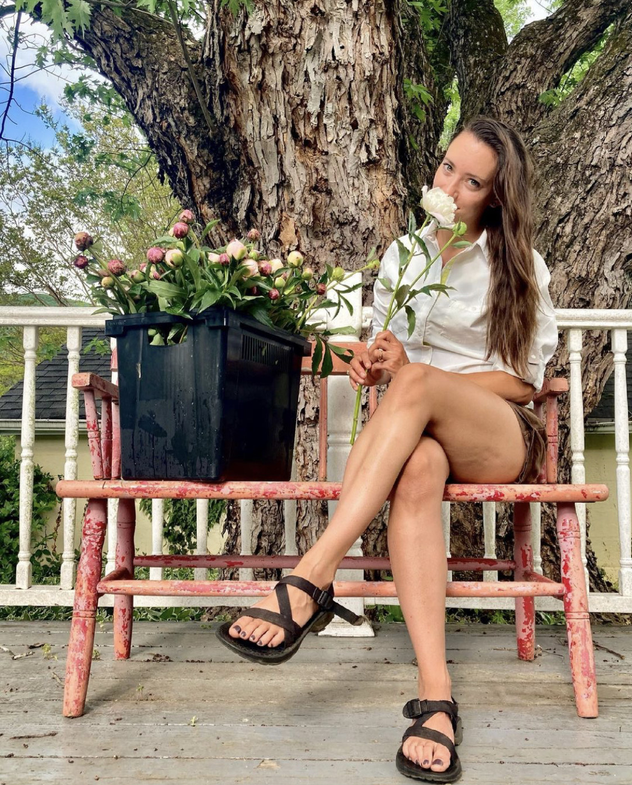

```{r setup, include=FALSE}
knitr::opts_chunk$set(echo = FALSE)
```

Thank you for visiting our website! Bandy Bloomery was founded in 2021 by Hillary Moore. 

**why**? 

{width="50%"}

Hillary Moore grew up South of Roanoke in Ferrum. She graduated from Radford University in XXXX with a BS in Biology. 

She's the proud owner of Bandy Bloomery and passionate about sustainable agriculture. What started as a hobby and interest rapidly became a passion. Most days you'll find her tending to the nearly half acre farm. When she isn't farming Hillary enjoys cycling with her partner Stephen and their dogs Daisy and Willow.  