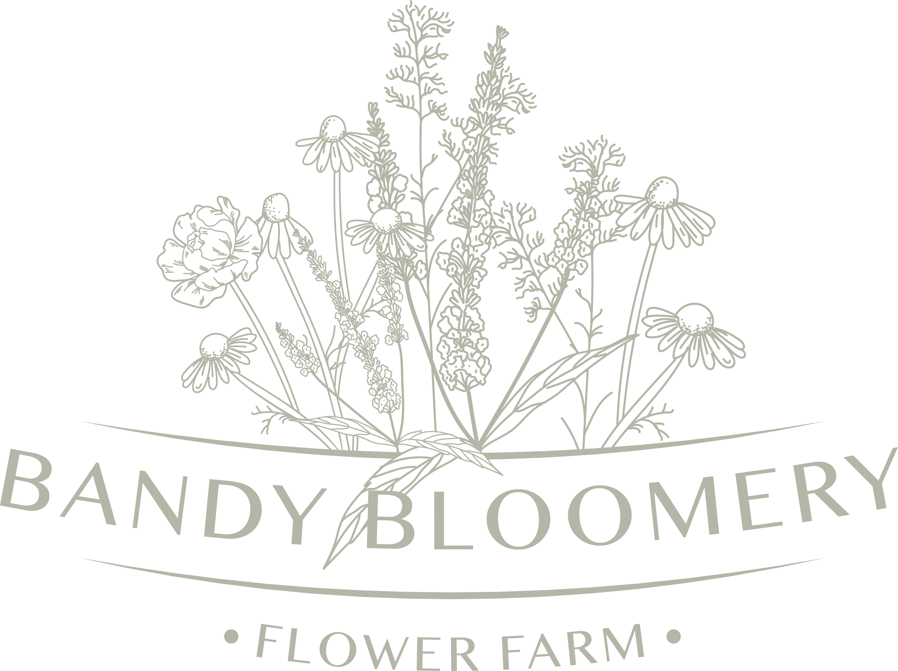
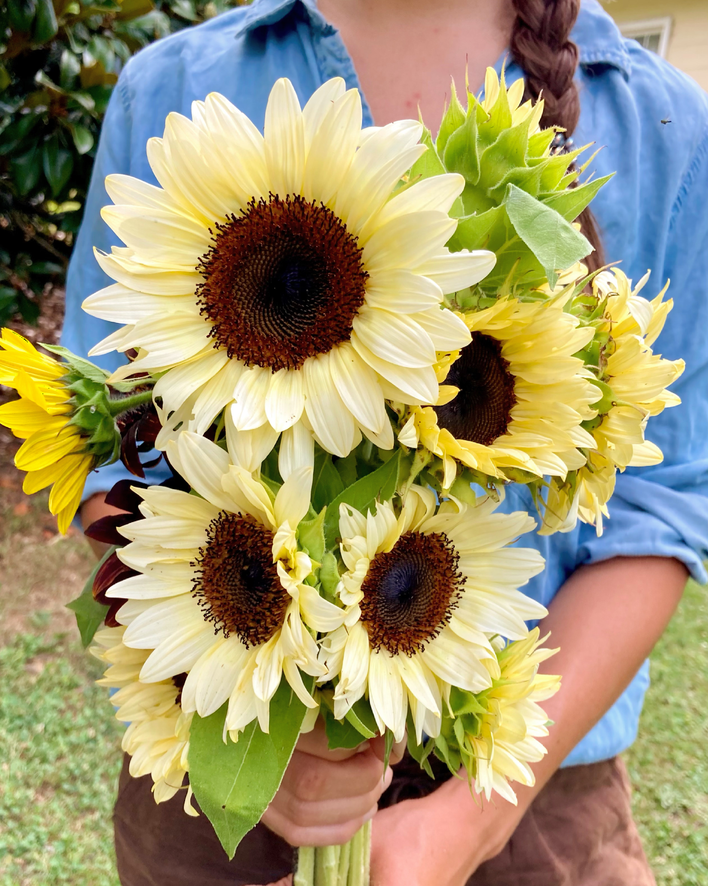
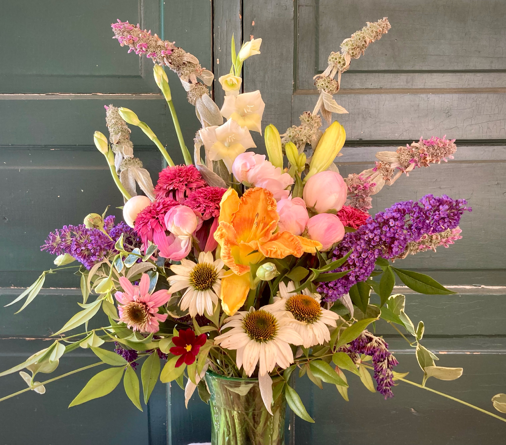
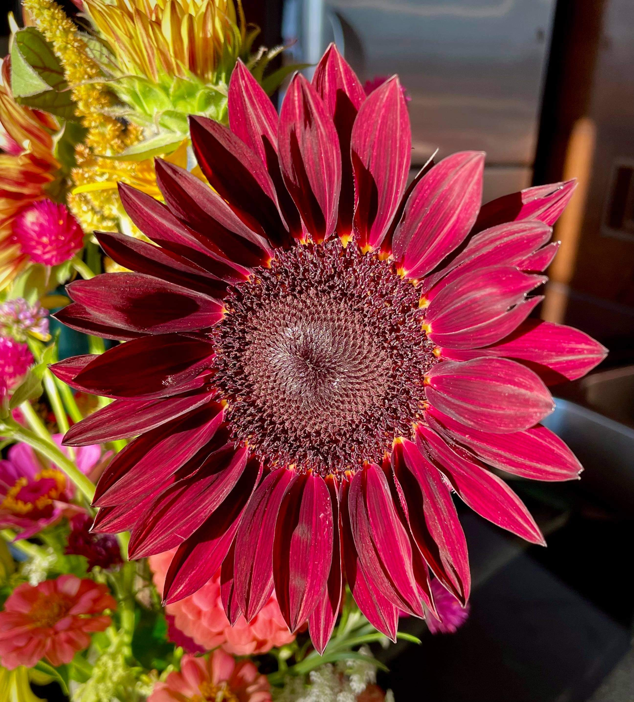

```{r setup, include=FALSE}
knitr::opts_chunk$set(echo = FALSE)

# Learn more about creating websites with Distill at:
# https://rstudio.github.io/distill/website.html

# Learn more about publishing to GitHub Pages at:
# https://rstudio.github.io/distill/publish_website.html#github-pages

```
<center>
{width="50%"}
</center>

<br>

Welcome to Bandy Bloomery! We are a micro-farm nestled in the Blue Ridge Mountains of the beautiful Roanoke Valley of Southwest Virginia. 

<center>
{width="50%"}
</center>

We grow specialty-cut flowers using organic and regenerative agriculture techniques that keep our soil and plants as happy and healthy as possible. Sustainable floristry is the heart of our farm and we are dedicated to "no-spray" and "no-till". This means we never use pesticides and take pride in building healthy living soil that grows stronger, more resilient and robust plants, without the use of conventional tilling.

<center>
{width="50%"}
</center>

The tiny farm, which started as a simple idea to build a small greenhouse for personal use, quickly evolved into a fully-fledged business. Over the course of 2021, we broke ground and constructed an unheated greenhouse, added over 200 feet of gardens and perennial plant beds, and built-out a dedicated seed starting area. We are now in the process of expanding into nearly two dozen flower beds on our little (almost) half-acre plot. It seems every few weeks the lawn gets a little smaller and the garden gets a little bigger!

<center>
{width="50%"}
</center>

In 2022 we plan to grow over 120 varieties of cut flowers throughout the season! Decorating and sharing seasonal flowers means you will never get bored of the ever changing shapes, colors, scents and textures of fresh flowers coming straight off the farm to your home. 

Follow along on social media and bring home a farm fresh bouquet today!

